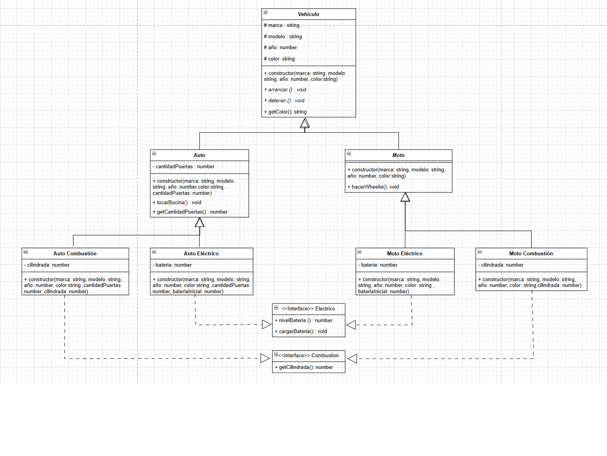

## Trabajo Practico N°1

### Indicaciones

## Primero

Ejecutar `npm install` en la carpeta "TrabajoPractico1"

## Segundo

Luego en la misma carpeta ejecutar `npm run build`

## Tercero

Ejecutar `npm run dev` para ver como funcionan

### Punto 5 UML

