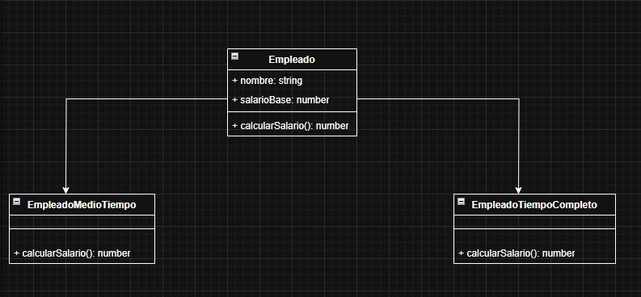

## Trabajo Practico N°1

### Indicaciones

## Primero

Ejecutar `npm install` en la carpeta "TrabajoPractico1"

## Segundo

Luego en la misma carpeta ejecutar `npm run build` para compilar

## Tercero

Por ultimo ejectura `npm run start` para ejecutar el archivo `main..js` en la carpeta dist

### Punto 3 UML

### Punto 5 UML

